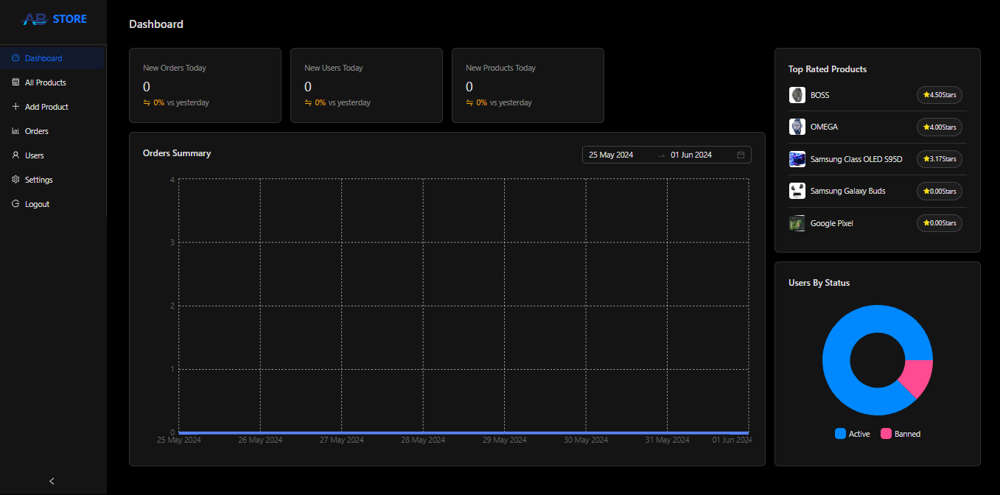
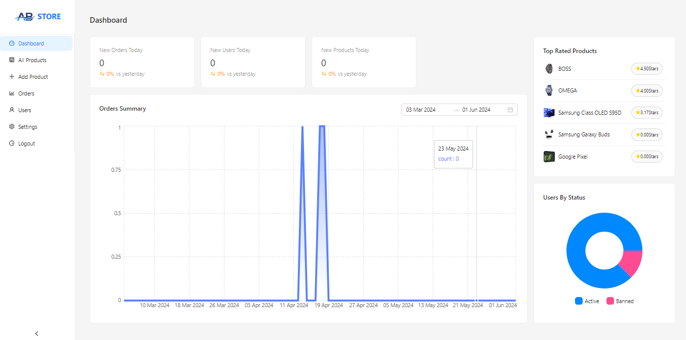
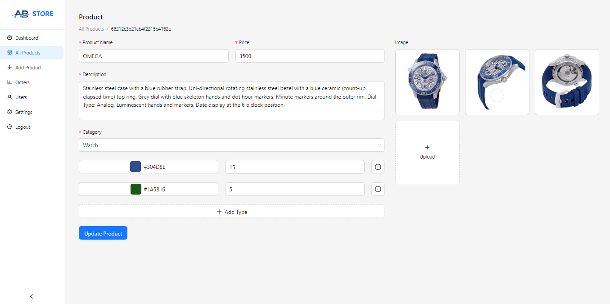
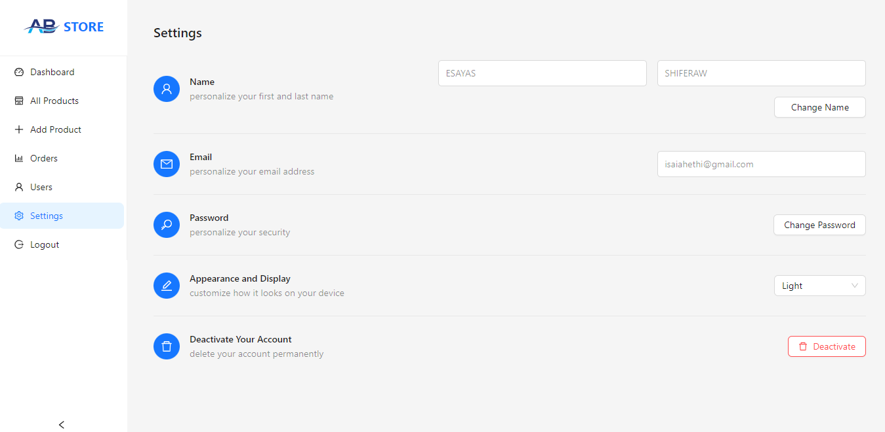

 # AB-STORE Admin

AbStoreadmin is a web-based interface designed for administrators to manage, monitor, and control various aspects of a website. It provides a centralized location for performing administrative tasks, ensuring smooth operation and maintenance of the system.

  

